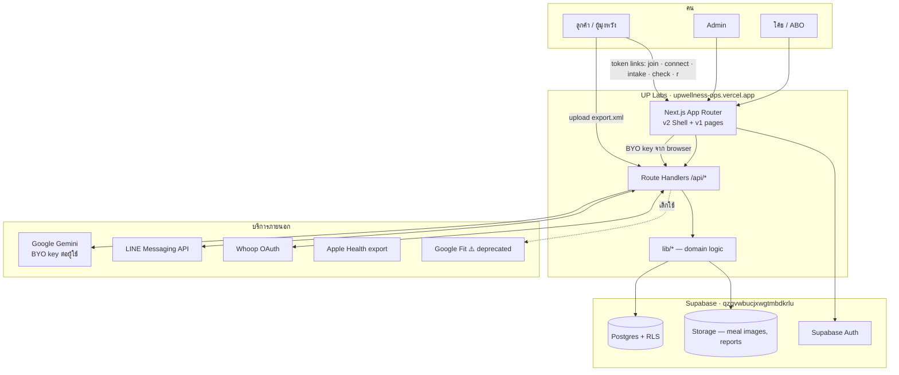
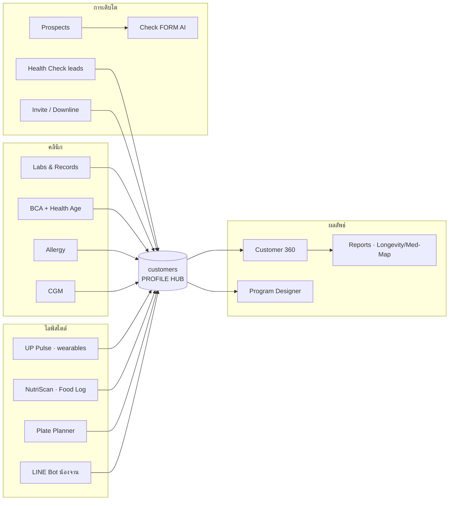

# System Architecture & Data Model — UP Labs

> คู่กับ [PRD-UPLabs.md](./PRD-UPLabs.md) · **Updated:** 2026-07-16
> ⚠️ **LIVING DOCUMENT** — เพิ่ม/แก้ตาราง โมดูล หรือ data flow เมื่อไหร่ ต้องอัปเดตไฟล์นี้ + `.html` ในคอมมิตเดียวกัน

---

## 1. System Context



**หลักการเชื่อม:** ทุก request ที่แตะข้อมูลลูกค้า ต้องผ่าน `getSession()` + `lib/customers/access.ts` เว้นแต่เป็น **token link สาธารณะ** ที่ตรวจ token เองในหน้านั้น

---

## 2. Layers

| ชั้น | ที่อยู่ | หน้าที่ |
|---|---|---|
| **Presentation** | `app/v2/*` (หลัก), `app/*` (v1) | UI · Shell (nav/switcher/breadcrumb/user menu) · client components |
| **API / BFF** | `app/api/**/route.ts` (60 routes) | auth gate → เรียก lib → ตอบ JSON · ที่เดียวที่คุยกับ external API |
| **Domain logic** | `lib/*` (45 modules) | กฎทางคลินิก/ธุรกิจ ไม่มี UI · เช่น `medical-status`, `bio-age`, `pulse/*`, `checkform/*` |
| **Data access** | `lib/supabase/{server,admin,client}.ts` | server = ผู้ใช้ (RLS) · admin = service-role (bypass, ใช้เฉพาะฝั่งเซิร์ฟเวอร์) |
| **Data** | Supabase Postgres + Storage | ตาราง 58 ตัว (28 ผูก customers) |

**Single sources of truth ที่ห้ามซ้ำ:**
`lib/medical-status.ts` (เกณฑ์+สีสถานะ) · `lib/bio-age.ts` (PhenoAge) · `lib/apps-registry.ts` (รายการแอป) · `lib/auth/roles.ts` (สิทธิ์) · `lib/gemini-error.ts` (key error) · `lib/customers/access.ts` (ใครเห็นลูกค้าคนไหน)

---

## 3. Module Map



อ่านว่า: **โมดูลด้านซ้ายทั้งหมด "เขียน" ลง customer profile · โมดูลด้านขวา "อ่าน" ออกมาเป็นคุณค่า** — เพิ่มโมดูลใหม่ก็ต้องต่อเข้าแกนเดียวกันนี้

---

## 4. Data Model — Customer Profile คือแกนกลาง

### 4.1 แกน

```
customers (46 แถว)
├─ id · coach_id → profiles · name · gender · birth_year/birth_date · height · cgm_profile_names[]
└─ ← มี 28 ตารางชี้เข้ามาที่ customers.id
```

### 4.2 ตารางที่ผูกกับลูกค้าโดยตรง (จัดกลุ่มตามโดเมน)

| กลุ่ม | ตาราง | เก็บอะไร |
|---|---|---|
| **ผลตรวจ** | `customer_records` → `customer_lab_values` | 1 record = 1 ครั้งที่ตรวจ · lab values ผูกกับ record (⚠️ `record_id` NOT NULL — ต้องสร้าง record ก่อน) |
| | `customer_report_html` | รายงาน HTML ส่วนตัว (PII — private) |
| **องค์ประกอบร่างกาย** | `measurements` (248) | น้ำหนัก ไขมัน กล้ามเนื้อ visceral body-age BMR |
| **ภูมิแพ้** | `customer_allergy_tests` → `customer_food_allergens` | ผลทดสอบ + รายการอาหารที่แพ้ |
| **น้ำตาลต่อเนื่อง** | `cgm_profiles` (+ `cgm_readings` >50k, `cgm_meals`) | CGM ต่อ profile · เข้าถึงด้วย passcode · นำเข้าผ่าน `/api/v1/…/cgm/import` |
| **อาหาร (food log)** | `nutriscan_scans` (+ `eaten_at` · `time_known` · `source` · `estimated_by` · `confirmed_at/by` · `edited` · `items`) | 3 ทาง: รูป · พิมพ์ · รูปเก่า (EXIF) · ทุกแถวมีคนยืนยันตัวเลขก่อนเก็บ · เขียนผ่าน `lib/food/store.ts` |
| **แผนดูแล** | `health_plans` (draft/final jsonb · edits · share_token · sent_at) | ร่างจาก assessment · โค้ชยืนยันก่อนส่ง · `/r/plan/<token>` อ่านได้เมื่อ sent |
| **ผลประเมินรวม** | `health_assessments` (jsonb `payload`) | UP Health Design — 1 แถวต่อการประเมิน ไม่ทับ · เขียนโดย `lib/health-design/load.ts` เท่านั้น (service role · RLS เปิด ไม่มี policy) |
| **OAuth (MCP)** | `oauth_clients` · `oauth_codes` · `oauth_refresh_tokens` · `api_tokens.oauth_client_id` | authorization server สำหรับ `/api/mcp` · access token = แถว `api_tokens` |
| **อุปกรณ์สวมใส่** | `pulse_connections` · `pulse_readings` · `biomarker_readings` · `wearable_connections` · `sync_jobs` | token (เข้ารหัส) + ค่าที่ดึงมา |
| | `whoop_daily` · `whoop_sleeps` · `whoop_workouts` · `whoop_journal` | ข้อมูล Whoop รายวัน/นอน/ออกกำลัง/บันทึก |
| | `pulse_intakes` → `pulse_assessments` | แบบสอบถาม → ผลประเมิน |
| | `pulse_invites` · `wearable_invites` | ลิงก์เชิญเชื่อมอุปกรณ์ |
| **โภชนาการ** | `nutriscan_scans` (29) · `plate_plan_config` · `supplement_schedule` | สแกนอาหาร · ตั้งค่าจาน · ตารางวิตามิน |
| **ความปลอดภัยยา** | `customer_supplement_safety` | safe/caution/avoid + สารที่ตีกับยา |
| **การสื่อสาร** | `line_bot_groups` (→ `line_bot_logs`) · `coach_notes` | ผูกกลุ่ม LINE · โน้ตโค้ช (ปักหมุด) |
| **ที่มา/สิทธิ์** | `healthcheck_leads` · `customer_assignments` · `customer_view_log` | lead ที่แปลงเป็นลูกค้า · มอบหมายโค้ช · log การเปิดดู |

### 4.3 คลัสเตอร์รอบนอก (ยังไม่ผูก customers)

| คลัสเตอร์ | ตาราง | หมายเหตุ |
|---|---|---|
| ผู้ใช้/สิทธิ์ | `profiles` (parent_id = downline), `user_invites`, `user_app_grants`, `admin_view_as_log` | MLM tree อยู่ที่ `profiles.parent_id` |
| ผู้มุ่งหวัง | `checkform_records`, `prospect_list`, `leads`, `metabolic_leads`, `aw_prospects`, `warm_leads` + 4 ตารางลูก | **โอกาส:** ยังไม่ต่อเข้า customers → ทำ "lead → customer" ให้ครบวงจรได้ |
| อื่น ๆ (คนละแอปในโปรเจกต์เดียวกัน) | `budgets`, `categories`, `transactions`, `symbols`, `losmtd`, `driver_logs`, `call_logs`, `contacts`, `link_hub` | ไม่ใช่ของ UP Labs — อย่าไปแตะ |

---

## 5. Data Flows หลัก

**① ผลแล็บเข้าโปรไฟล์**
`ใบตรวจ (PDF/รูป) → อ่านค่าจริง → customer_records (1 ครั้ง) → customer_lab_values (หลายค่า + status) → Customer 360 (Labs/Trends/Body Map) → Longevity Report`

**② เชื่อมนาฬิกา**
`โค้ชสร้าง invite → ลูกค้าเปิด /connect/[token] → OAuth → เก็บ token (เข้ารหัส lib/pulse/crypto) ใน pulse_connections → sync → pulse_readings/whoop_* → รายงาน /pulse/report/[id] → แชร์ /r/[token]`

**③ AI วิเคราะห์ (BYO key)**
`client อ่านคีย์จาก localStorage → POST /api/... พร้อม apiKey → lib เรียก Gemini → คืนผล → cache ลง DB` · คีย์พัง → `GeminiKeyErrorNotice` ชวนไปขอคีย์ใหม่

**④ Check FORM → ผู้มุ่งหวัง**
`โปรไฟล์+DISC → Gemini → แนวทางเข้าหา + clip STP → cache ใน checkform_records → prospect_list`

**⑤ สมาชิกใหม่ (MLM)**
`/v2/invite → user_invites → ลิงก์ /join/[token] → สมัคร → profiles.parent_id = ผู้เชิญ → เห็น downline แบบอ่านอย่างเดียว`

**⑥ LINE ประจำวัน**
`cron → /api/line/push-tomorrow → อ่าน plate_plan_config + supplement_schedule → ส่ง Flex เข้ากลุ่มใน line_bot_groups → log`

---

## 6. Security & Access

| ชั้น | กลไก |
|---|---|
| Auth | Supabase Auth (email+password) · session ผ่าน `lib/auth/session.ts` |
| Role | `admin` / `abo` (`lib/auth/roles.ts`) + `user_app_grants` รายแอป |
| ข้อมูลลูกค้า | `lib/customers/access.ts` → **`canManageCustomer()` = ด่านเดียว** — เจ้าของ (`coach_id`) · ผู้ได้รับมอบหมาย (`customer_assignments`) · **upline ของเจ้าของทุกระดับชั้น (อ่าน+เขียน · recursive ผ่าน RPC `profile_descendant_ids`)** · ห้าม route เขียนเช็คสิทธิ์เอง (เคยทำให้ read/write ไม่ตรงกัน → `forbidden` งง ๆ) |
| RLS | เปิดบนตารางอ่อนไหว (เช่น `cgm_readings`, `cgm_meals`) · CGM ใช้ passcode + SECURITY DEFINER RPC |
| Service role | ใช้ได้เฉพาะ `lib/supabase/admin.ts` ฝั่งเซิร์ฟเวอร์ · ห้ามหลุดไป client |
| ลิงก์สาธารณะ | token แบบใช้ครั้งเดียว/มีวันหมดอายุ (`user_invites`, `pulse_invites`, `pulse_intakes`) |
| ความลับ | AI key = BYO ในเบราว์เซอร์ · token อุปกรณ์เข้ารหัสก่อนเก็บ · **repo public → ห้าม commit PII** |
| Audit | `customer_view_log` · `admin_view_as_log` · `line_bot_logs` |

---

## 7. 🚀 ต่อยอดอะไรได้อีก (จากแกน customer profile ที่มีอยู่แล้ว)

จัดลำดับตาม *ใช้ข้อมูลที่มีอยู่แล้ว → คุณค่าสูง → งานน้อย*

| # | โอกาส | ใช้ข้อมูลที่มีแล้ว | ต้องเพิ่ม | คุณค่า |
|---|---|---|---|---|
| 1 | **Longevity Report ปุ่มเดียวในแอป** | labs + measurements + pulse + bio-age | template renderer ในระบบ | ส่งมอบเร็วขึ้นมาก · เป็นบริการมาตรฐาน |
| 2 | **Health Age trend** (PhenoAge หลายครั้ง) | `customer_lab_values` ย้อนหลัง | กราฟ + เก็บผลคำนวณ | ลูกค้าเห็น "อายุสุขภาพลดลง" = แรงจูงใจแรงที่สุด |
| 3 | **Attention Queue** — ใครต้องดูแลด่วนวันนี้ | status ของทุก lab/BCA + วันที่ล่าสุด | หน้า dashboard + rule | โค้ชเลิกเดาว่าจะโทรหาใคร |
| 4 | **Auto supplement stack** | lab values + `customer_supplement_safety` + ยาที่บันทึก | rule engine + แคตตาล็อก | คำแนะนำเฉพาะคนแบบมีเหตุผล + ปลอดภัยกับยา |
| 5 | **อาหาร ↔ น้ำตาล** | `nutriscan_scans` + `cgm_readings` | join ตามเวลา + วิเคราะห์ | "อาหารจานนี้ทำให้น้ำตาลคุณขึ้นเท่าไร" — ของจริงเฉพาะบุคคล |
| 6 | **นอน/HRV ↔ ค่าอักเสบ** | `whoop_*` + labs (hs-CRP) | correlation view | เชื่อมไลฟ์สไตล์กับผลเลือดให้เห็นภาพ |
| 7 | **Program outcome analytics** | `measurements` + labs ก่อน/หลัง + โปรแกรม | ผูก "โปรแกรม" เป็น entity | พิสูจน์ผลลัพธ์เป็นตัวเลข → ใช้ขาย/ปรับสูตร |
| 8 | **Adherence score** | LINE log + nutriscan + การเข้าใช้ | สูตรคะแนน | รู้ว่าใครกำลังหลุด ก่อนจะหลุดจริง |
| 9 | **Household / family linking** | ที่อยู่ + ผู้แนะนำ (เคส Benz–Por บ้านเดียวกัน) | field `household_id` | ดูแลทั้งบ้าน = LTV สูงขึ้น |
| 10 | **Lead → Customer ครบวงจร** | `healthcheck_leads`, `prospect_list`, `warm_leads` | FK เข้า customers + funnel view | ปิดช่องว่างที่ lead ยังไม่ต่อกับโปรไฟล์ |
| 11 | **Coach / downline analytics** | `profiles.parent_id` + customers ต่อโค้ช | dashboard | เห็นว่าทีมใครโตจริง ช่วยโค้ชที่ต้องการ |
| 12 | **Benchmark แบบไม่ระบุตัวตน** | ค่า lab/BCA ทั้งฐาน | aggregate + de-identify | "คนวัยเดียวกันค่าเฉลี่ยเท่าไร" เพิ่มความน่าเชื่อถือ |
| 13 | **Clip/content แนะนำจากสุขภาพ** | STP matcher + โปรไฟล์สุขภาพจริง | ขยาย matcher ให้รับ customer | ให้คอนเทนต์ที่ตรงกับปัญหาเขาจริง |

> ทั้ง 13 ข้อ **ไม่ต้องเก็บข้อมูลใหม่** — เป็นการ "อ่านแกนเดิมในมุมใหม่" ซึ่งเป็นข้อดีของการมี customer profile เป็นศูนย์กลางตั้งแต่ต้น

---

## 8. Conventions สำหรับคนที่มาต่อ

1. ฟีเจอร์ใหม่ที่เกี่ยวกับคน → **ต้องมี `customer_id`** อย่าสร้างเกาะข้อมูลใหม่
2. ตรรกะคลินิกอยู่ใน `lib/` เท่านั้น (หน้าเว็บห้ามตัดสินเกณฑ์เอง)
3. API route = ด่านตรวจสิทธิ์ + ที่เดียวที่คุยกับภายนอก
4. เพิ่มแอป → ลงทะเบียนใน `lib/apps-registry.ts` และเพิ่มลิงก์ v2 ใน `Shell.tsx`
5. แก้ฟีเจอร์ → **อัปเดต PRD + ARCHITECTURE (md และ html) ในคอมมิตเดียวกัน**
